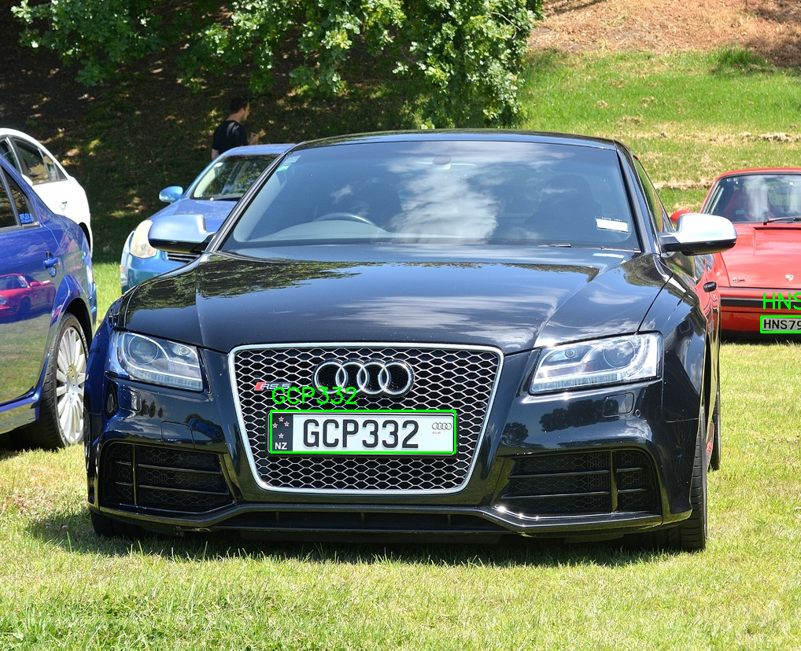
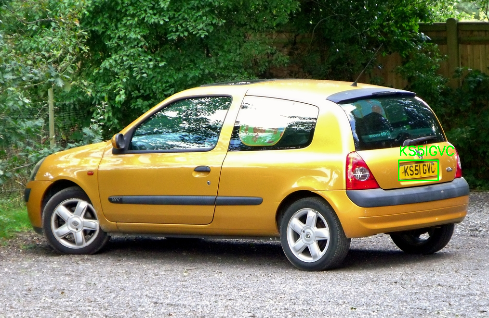
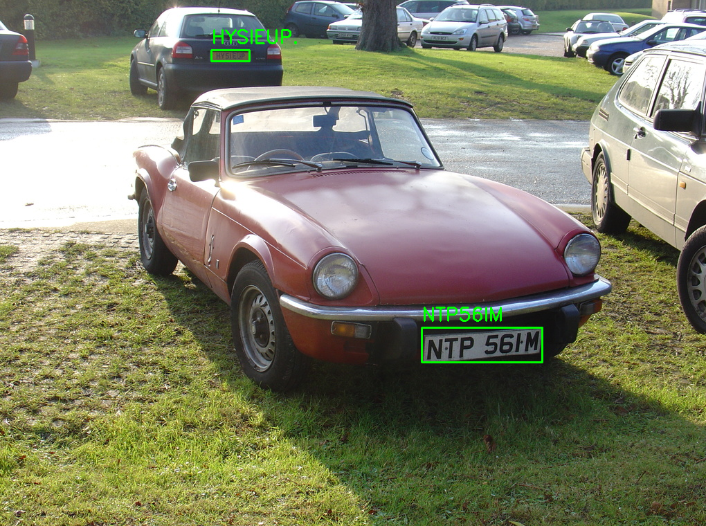

# License-Plate-Recognition

This project implements a license plate detection and recognition system using YOLOv8 for object detection and PaddleOCR for text recognition.

## Project Structure

- `arg_parser.py`: Handles command-line argument parsing for both training and inference.
- `main.py`: The main script for running license plate detection and recognition on images.
- `ocr_engine.py`: Implements the OCR functionality using PaddleOCR.
- `plate_detector.py`: Implements the license plate detection using YOLOv8.
- `train.py`: Script for training the YOLOv8 model on the license plate dataset.
- `model.pt`: Pre-trained YOLOv8 model for license plate detection.

## Pre-trained Model

This repository includes a pre-trained model (`model.pt`, 6,097 KB) in the root directory. This model was trained on the Large License Plate Dataset and can be used directly with the `main.py` script.

Model details:
- File size: 6,097 KB
- Training dataset: [Large License Plate Dataset](https://www.kaggle.com/datasets/fareselmenshawii/large-license-plate-dataset)
- Last updated: 08/04/2024

If you want to train your own model or use a different one, refer to the Training section below.

## Installation

1. Clone this repository:
   ```
   git clone https://github.com/kevinlin5115/License-Plate-Recognition.git
   cd License-Plate-Recognition
   ```

2. Install the required packages:
   ```
   pip install -r requirements.txt
   ```

## Usage

### Detection and Recognition

To run the license plate detection and recognition on a set of images:

```
python main.py --model path/to/model.pt --img-dir path/to/image/directory --device cuda
```

Additional options:
- `--conf-threshold`: Set the confidence threshold for detections (default: 0.25)
- `--device`: Specify the device to run on (e.g., 'cuda', 'cpu', '0', '0,1,2,3')

### Training

To train the YOLOv8 model on your license plate dataset:

```
python train.py --data path/to/data.yaml --epochs 100 --img-size 640 --batch-size 16 --weights yolov8n.pt
```

## Example Outputs

Here are some example outputs from my license plate detection and recognition system:

### Example 1: Clear, front-facing license plate



- Detection confidence: 0.71
- Recognized text: GCP332

### Example 2: Angled license plate



- Detection confidence: 0.78
- Recognized text: KS5IGVC



Plate 1:
- Detection confidence: 0.82
- Recognized text: NTP56IM

Plate 2:
- Detection confidence: 0.70
- Recognized text: HYSIEUP.

## Dataset

This project uses the Large License Plate Dataset available on Kaggle:
[Large License Plate Dataset](https://www.kaggle.com/datasets/fareselmenshawii/large-license-plate-dataset)

## Dependencies
- torch
- ultralytics
- opencv-python
- numpy
- paddlepaddle
- paddleocr
- PyYAML

## Acknowledgements

- YOLOv8 by Ultralytics
- PaddleOCR by PaddlePaddle
